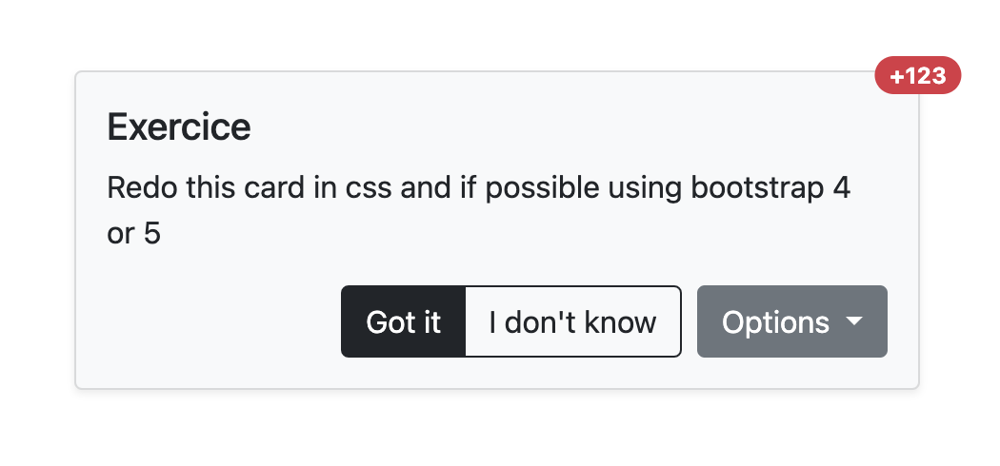

# NodeJs

## Exercice: Is there a problem? _(1 points)_

```javascript
// Call web service and return count user, (got is library to call url)
async function getCountUsers() {
  return { total: await got.get('https://my-webservice.moveecar.com/users/count') };
}

// Add total from service with 20
async function computeResult() {
  const result = getCountUsers();
  return result.total + 20;
}
```
## Answer:
When calling getCountUsers inside computeResult, you need to use the await keyword to wait for the asynchronous call to complete:

```javascript
async function computeResult() {
  const result = await getCountUsers();
  return result.total + 20;
}
```

<br><br><br>

## Exercice: Is there a problem? _(2 points)_

```javascript
// Call web service and return total vehicles, (got is library to call url)
async function getTotalVehicles() {
    return await got.get('https://my-webservice.moveecar.com/vehicles/total');
}

function getPlurial() {
    let total;
    getTotalVehicles().then(r => total = r);
    if (total <= 0) {
        return 'none';
    }
    if (total <= 10) {
        return 'few';
    }
    return 'many';
}
```
## Answer:
Yes, the logic regarding which string to return should be wrapped inside the .then callback due to the asynchronous nature of 
getTotalVehicles(). 

Furthermore, whilst it is not necessarily a problem, having error catching in place helps to fix potential future problems:

```javascript
function getPlurial() {
    return getTotalVehicles().then(total => {
        if (total <= 0) {
            return 'none';
        }
        if (total <= 10) {
            return 'few';
        }
        return 'many';
    }).catch(error => {
        // Handle error, e.g., log or return a default value
        console.error(error);
        return 'error';
    });
}
```

<br><br><br>

## Exercice: Unit test _(2 points)_

Write unit tests in jest for the function below in typescript

```typescript
import { expect, test } from '@jest/globals';

function getCapitalizeFirstWord(name: string): string {
  if (name == null) {
    throw new Error('Failed to capitalize first word with null');
  }
  if (!name) {
    return name;
  }
  return name.split(' ').map(
    n => n.length > 1 ? (n.substring(0, 1).toUpperCase() + n.substring(1).toLowerCase()) : n
  ).join(' ');
}
```

## Answer: 
Five tests provided below.

**NOTE:** The first test will fail because the function, in its current state, will capitalize the first letter
of **EVERY** word in a sentence - not just the first.
```
test('capitalize first letter of first word of a sentence', () => {
  const result = getCapitalizeFirstWord('hello world');
  expect(result).toBe('Hello world');
});

test('handle strings with a combination of upper and lower-case lettering', () => {
  const result = getCapitalizeFirstWord('jAMEs');
  expect(result).toBe('James');
});

test('handle empty string', () => {
  const result = getCapitalizeFirstWord('');
  expect(result).toBe('');
});

test('handle null input', () => {
  expect(() => {
    getCapitalizeFirstWord(null);
  }).toThrow('Failed to capitalize first word with null');
});

test('capitalize single word', () => {
  const result = getCapitalizeFirstWord('javascript');
  expect(result).toBe('Javascript');
});
```

<br><br><br>

# Angular

## Exercice: Is there a problem and improve the code _(5 points)_

```typescript
@Component({
  selector: 'app-users',
  template: `
    <input type="text" [(ngModel)]="query" (ngModelChange)="querySubject.next($event)">
    <div *ngFor="let user of users">
        {{ user.email }}
    </div>
  `
})
export class AppUsers implements OnInit {

  query = '';
  querySubject = new Subject<string>();

  users: { email: string; }[] = [];

  constructor(
    private userService: UserService
  ) {
  }

  ngOnInit(): void {
    concat(
      of(this.query),
      this.querySubject.asObservable()
    ).pipe(
      switchMap(q =>
        timer(0, 60000).pipe(
          this.userService.findUsers(q)
        )
      )
    ).subscribe({
      next: (res) => this.users = res
    });
  }
}
```
## Answer:

1. It's important to unsubscribe from subscriptions to avoid memory leaks. You can use the `takeUntil` operator to automatically unsubscribe when the component is destroyed. This requires the importation of `OnDestroy` (from '@angular/core') and `takeUntil` (from 'rxjs/operators').
2. `switchMap` should be used instead of concatMap. The reason lies in the nature of the two operators. `concatMap` maintains the order of emitted values. If a new value is emitted while the previous observable is still active, the new observable is queued and will be processed after the previous one completes. We do not require observables to be queued here because all previous emitted values are irrelevant and should be ignored. If the value is updated while the previous observable is still active, `switchMap` cancels the previous observable and switches to the new one. `switchMap` is what we require.
3. You should add a debounce time to the user input to avoid unnecessary API calls while the user is typing. This requires the importation of `debounceTime` from 'rxjs/operators'.
4. You might want to introduce some error-handling in the observable. This requires the importation of `catchError` from 'rxjs/operators'

```typescript
@Component({
  selector: 'app-users',
  template: `
    <input type="text" [(ngModel)]="query" (ngModelChange)="querySubject.next($event)">
    <div *ngFor="let user of users">
        {{ user.email }}
    </div>
  `
})
export class AppUsers implements OnInit {
  query = '';
  querySubject = new Subject<string>();
  destroy$ = new Subject<void>();

  users: { email: string; }[] = [];

  constructor(
    private userService: UserService
  ) {
  }

  ngOnInit(): void {
    concat(
      of(this.query),
      this.querySubject.asObservable()
    ).pipe(
      debounceTime(300), // Introduction of adjustable debounce time
      switchMap(q =>
        timer(0, 60000).pipe(
          takeUntil(this.destroy$), // Handles the unsubscription once the component is destroyed
          this.userService.findUsers(q)
        )
      ),
      catchError(error => {
        console.error('An error occurred in the service:', error);
        return [];
      })
    )
    .subscribe({
      next: (res) => this.users = res
    });
  }
  
  // Added important handling of final lifecycle event
  ngOnDestroy(): void {
    this.destroy$.next();
    this.destroy$.complete();
  }
}
```

<br><br><br>

## Exercice: Improve performance _(5 points)_

```typescript
@Component({
  selector: 'app-users',
  template: `
    <div *ngFor="let user of users">
        {{ getCapitalizeFirstWord(user.name) }}
    </div>
  `
})
export class AppUsers {

  @Input()
  users: { name: string; }[];

  constructor() {}
  
  getCapitalizeFirstWord(name: string): string {
    return name.split(' ').map(n => n.substring(0, 1).toUpperCase() + n.substring(1).toLowerCase()).join(' ');
  }
}
```

## Answer: 
The logic responsible for manipulating the presentation of data in the DOM is best separated from component directives and placed in its own directive (a custom **pipe** directive). Fortunately, in this scenario, Angular already offers a built-in pipe, `titlecase`, which  handles the task of capitalizing the first letter of each word. By using this built-in feature, we promote a cleaner and more modular code structure within our Angular components.
```typescript
@Component({
  selector: 'app-users',
  template: `
    <div *ngFor="let user of users">
        {{ user.name | titlecase }}
    </div>
  `
})
export class AppUsers {

  @Input()
  users: { name: string; }[];

  constructor() {}
  /* REMOVE
  getCapitalizeFirstWord(name: string): string {
    return name.split(' ').map(n => n.substring(0, 1).toUpperCase() + n.substring(1).toLowerCase()).join(' ');
  }
  */
}
```

<br><br><br>

## Exercice: Forms _(8 points)_

Complete and modify `AppUserForm` class to use Angular Reactive Forms. Add a button to submit.

The form should return data in this format

```typescript
{
  email: string; // mandatory, must be a email
  name: string; // mandatory, max 128 characters
  birthday?: Date; // Not mandatory, must be less than today
  address: { // mandatory
    zip: number; // mandatory
    city: string; // mandatory, must contains only alpha uppercase and lower and space
  };
}
```

```typescript
@Component({
  selector: 'app-user-form',
  template: `
    <form>
        <input type="text" placeholder="email">
        <input type="text" placeholder="name">
        <input type="date" placeholder="birthday">
        <input type="number" placeholder="zip">
        <input type="text" placeholder="city">
    </form>
  `
})
export class AppUserForm {

  @Output()
  event = new EventEmitter<{ email: string; name: string; birthday: Date; address: { zip: number; city: string; };}>;
  
  constructor(
    private formBuilder: FormBuilder
  ) {
  }

  doSubmit(): void {
    this.event.emit(...);
  }
}
```
## Answer:
* Imported **Validators** from @angular/forms to use built-in validators for form controls.
* Created a **FormGroup** named userForm using the **formBuilder.group** method.
* Added form controls with their initial values and associated validators.
* Used the **formControlName** directive to bind form controls to HTML input elements.
* Added `<div>` elements with ***ngIf** directives to display error messages based on the form control's validity state.
* Error messages are displayed only if the corresponding form control has been touched and has a specific error.
* Added a `Submit` button with the `[disabled]` attribute set to `userForm.invalid` in order to disable the button if the form is invalid.
* Modified the **doSubmit** function to check if the form is valid before emitting the event. If the form is not valid, the submit action is prevented.

``` typescript
import { Component, EventEmitter, Output } from '@angular/core';
import { FormBuilder, FormGroup, Validators } from '@angular/forms';

@Component({
  selector: 'app-user-form',
  template: `
    <form [formGroup]="userForm" (ngSubmit)="doSubmit()">
      <div>
        <label>Email:</label>
        <input type="text" formControlName="email">
        <div *ngIf="userForm.get('email').hasError('required') && userForm.get('email').touched">
          Email is required.
        </div>
        <div *ngIf="userForm.get('email').hasError('email') && userForm.get('email').touched">
          Please enter a valid email.
        </div>
      </div>

      <div>
        <label>Name:</label>
        <input type="text" formControlName="name">
        <div *ngIf="userForm.get('name').hasError('required') && userForm.get('name').touched">
          Name is required.
        </div>
        <div *ngIf="userForm.get('name').hasError('maxlength') && userForm.get('name').touched">
          Maximum length is 128 characters.
        </div>
      </div>

      <div>
        <label>Birthday:</label>
        <input type="date" formControlName="birthday">
      </div>

      <div>
        <label>Zip:</label>
        <input type="number" formControlName="zip">
        <div *ngIf="userForm.get('zip').hasError('required') && userForm.get('zip').touched">
          Zip is required.
        </div>
      </div>

      <div>
        <label>City:</label>
        <input type="text" formControlName="city">
        <div *ngIf="userForm.get('city').hasError('required') && userForm.get('city').touched">
          City is required.
        </div>
        <div *ngIf="userForm.get('city').hasError('pattern') && userForm.get('city').touched">
          Please enter a valid city name.
        </div>
      </div>

      <button type="submit" [disabled]="userForm.invalid">Submit</button>
    </form>
  `
})
export class AppUserForm {
  @Output() event = new EventEmitter<{
    email: string;
    name: string;
    birthday?: Date;
    address: { zip: number; city: string };
  }>();

  userForm: FormGroup;

  constructor(private formBuilder: FormBuilder) {
    this.userForm = this.formBuilder.group({
      email: ['', [Validators.required, Validators.email]],
      name: ['', [Validators.required, Validators.maxLength(128)]],
      birthday: [null as Date],
      zip: ['', [Validators.required]],
      city: ['', [Validators.required, Validators.pattern(/^[a-zA-Z ]*$/)]],
    });
  }

  doSubmit(): void {
    if (this.userForm.valid) {
      this.event.emit(this.userForm.value);
    }
  }
}
```

<br><br><br>

# CSS & Bootstrap

## Exercice: Card _(5 points)_



## Answer
My card design using SCSS and Bootstrap 5 can be found on StackBlitz:  [Click here](https://stackblitz.com/edit/stackblitz-starters-wepwax?file=src%2Fstyles.scss){:target="_blank"}

<br><br><br>

# MongoDb

## Exercice: MongoDb request _(3 points)_

MongoDb collection `users` with schema

``` typescript
  {
    email: string;
    first_name: string;
    last_name: string;
    roles: string[];
    last_connection_date: Date;
  }
```

Complete the query, you have a variable that contains a piece of text to search for. Search by exact email, starts with first or last name and only users logged in for 6 months

``` typescript
db.collections('users').find(...);
```

What should be added to the collection so that the query is not slow?

## Answer:
``` typescript
let searchText = "text";  // Replace with the actual text to search for
const sixMonthsAgo = new Date();
sixMonthsAgo.setMonth(sixMonthsAgo.getMonth() - 6);

db.collection('users').find({
  $or: [
    { email: searchText },
    { first_name: { $regex: `^${searchText}`, $options: 'i' } },
    { last_name: { $regex: `^${searchText}`, $options: 'i' } }
  ],
  last_connection_date: { $gte: sixMonthsAgo }
});
```
To optimize this query, you should ensure that the `email`, `first_name`, and `last_name` fields are **indexed**. Indexing these fields can significantly improve the performance of the search. The concept is applicable to both SQL (which I am more familiar with) and NoSQL databases. Indexes are data structures that provide a quick and efficient way to look up records based on the values in one or more columns.

You can create indexes as follows:
``` typescript
db.collection('users').createIndex({ email: 1 });
db.collection('users').createIndex({ first_name: 1 });
db.collection('users').createIndex({ last_name: 1 });
db.collection('users').createIndex({ last_connection_date: 1 });
```

<br><br><br>

## Exercice: MongoDb aggregate _(5 points)_

MongoDb collection `users` with schema

``` typescript
  {
    email: string;
    first_name: string;
    last_name: string;
    roles: string[];
    last_connection_date: Date;
  }
```

Complete the aggregation so that it sends user emails by role ({_id: 'role', users: [email,...]})

``` typescript
db.collections('users').aggregate(...);
```
## Answer:
``` typescript
db.collection('users').aggregate([
  {
    $unwind: '$roles' // Unwind the roles array to create a separate document for each role
  },
  {
    $group: {
      _id: '$roles', // Group by role
      users: { $addToSet: '$email' } // Collect emails into an array for each role. Use $addToSet to avoid duplicate emails
    }
  },
  {
    $project: {
      _id: '$_id',
      users: 1
    }
  }
]);

```
The aggregation pipeline would produce the following output:
```
[
  { "_id": "admin", "users": ["admin@example.com", "admin2@example.com"] },
  { "_id": "user", "users": ["user1@example.com", "user2@example.com"] },
  { "_id": "sales", "users": ["sales@example.com"] }
]
```

<br><br><br>

## Exercice: MongoDb update _(5 points)_

MongoDb collection `users` with schema

``` typescript
  {
    email: string;
    first_name: string;
    last_name: string;
    roles: string[];
    last_connection_date: Date;
    addresses: {
        zip: number;
        city: string;
    }[]:
  }
```

Update document `ObjectId("5cd96d3ed5d3e20029627d4a")`, modify only `last_connection_date` with current date

``` typescript
db.collections('users').updateOne(...);
```
## Answer:
``` typescript
db.collection('users').updateOne(
  { _id: ObjectId("5cd96d3ed5d3e20029627d4a") },
  { $set: { last_connection_date: new Date() } }
);
```
<br><br>

Update document `ObjectId("5cd96d3ed5d3e20029627d4a")`, add a role `admin`

``` typescript
db.collections('users').updateOne(...);
```
## Answer:
``` typescript
db.collection('users').updateOne(
  { _id: ObjectId("5cd96d3ed5d3e20029627d4a") },
  { $addToSet: { roles: 'admin' } }
);
```
<br><br>
Update document `ObjectId("5cd96d3ed5d3e20029627d4a")`, modify addresses with zip `75001` and replace city with `Paris 1`

``` typescript
db.collections('users').updateOne(...);
```
## Answer:
``` typescript
db.collection('users').updateOne(
  { _id: ObjectId("5cd96d3ed5d3e20029627d4a"), "addresses.zip": 75001 },
  { $set: { "addresses.$.city": "Paris 1" } }
);
```
